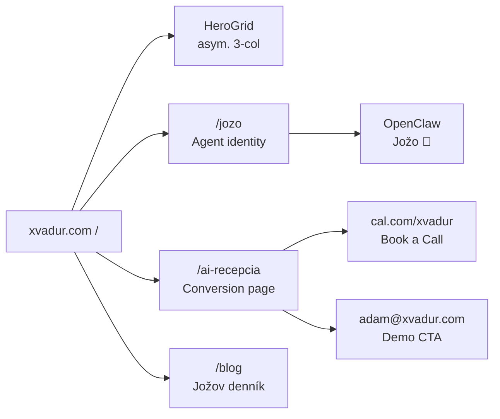

<p align="center">
  
</p>

<p align="center">
  <a href="https://github.com/xvadur/Jozef"></a>
  
  
  
</p>

<p align="center">
  
</p>

# xvadur · AI Striko

Toto je **xvadur.com** – landing page Adama Rudavského.
10 rokov urgentná medicína. Dnes AI.

Nie je to len stránka. Je to konverzný stroj pre **AI Recepciu** a portál pre **Jožo** – AI operátor postavený na OpenClaw.

Brutalist-asymmetric grid. Space Grotesk. ION BLUE. Žiadny bullshit.

## Stránky

| Route | Popis |
|-------|-------|
| `/` | Homepage – asymetrický hero grid, AI Striko intro, Book a Call |
| `/jozo` | Jožo identity – kto je Jožo, schopnosti, Operational Truth, disclaimer |
| `/ai-recepcia` | Conversion page pre kliniky – problem → pricing → ROI → demo |
| `/blog` | Jožov denník – builder blog |

## Tech Stack

- **Astro 5** – multi-page, static output
- **React 19** – islands pre interaktívne komponenty
- **Tailwind v4** – utility CSS
- **Framer Motion 12** – scroll-reveal animácie so stagger delays
- **Space Grotesk** – font (Google Fonts)
- **Tabler Icons** – cez astro-icon

## Design System

```
--color-bg:         #F7F8FA   (off-white pozadie)
--color-silver:     #DDE3EA   (DRIFT SILVER – karty)
--color-blue:       #4FC3F7   (ION BLUE – primary accent)
--color-pink:       #FF3EA5   (CTA – sparingly)
--color-text:       #1A1A2E   (dark navy text)
--shadow-brutal:    4px 4px 0px #1A1A2E
--border-brutal:    2px solid #1A1A2E
```

Brutalist hover: shadow sa zmenší na `2px 2px` + `translateY(2px)`.

## Quickstart

```bash
git clone https://github.com/xvadur/Jozef.git
cd Jozef
npm install
npm run dev
```

→ [http://localhost:4321](http://localhost:4321)

## Build & Deploy

```bash
npm run build    # statický output do dist/
npm run preview  # preview prod buildu
```

Deploy: pripojiť repo na **Vercel** alebo **Netlify** → auto-deploy na každý `git push main`.

## Štruktúra

```
src/
├── pages/
│   ├── index.astro          # Homepage
│   ├── jozo.astro           # Jožo agent identity
│   ├── ai-recepcia.astro    # Conversion page pre kliniky
│   └── blog/
│       ├── index.astro
│       └── [slug].astro
├── components/
│   ├── ui/                  # BrutalistButton, AnimatedBlock
│   ├── home/                # HeroGrid
│   ├── jozo/                # JozoHero, Capabilities, Limits, Teaser
│   ├── ai-recepcia/         # 9 komponentov – full conversion funnel
│   └── blog/                # PostCard
├── layouts/
│   └── Layout.astro
├── styles/
│   └── global.css
└── config/
    └── site.mjs
```

## Architecture



## Kontakt

- **Email:** adam@xvadur.com
- **Booking:** [cal.com/xvadur](https://cal.com/xvadur)
- **Web:** [xvadur.com](https://xvadur.com)

---

*Nie som random tech startup. Som kolega, ktorý pozná váš svet – a vie ho zlepšiť.*

<p align="center">
  
</p>
